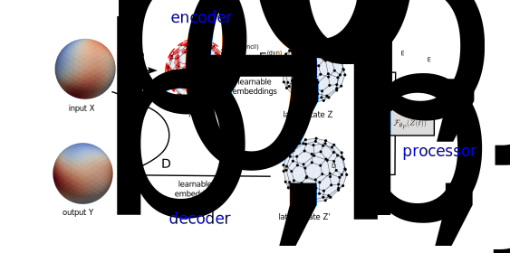

## Neural PDE

[Firedrake](https://www.firedrakeproject.org/)/[PyTorch](https://pytorch.org/) implementation of a neural surrogate model for time-dependent PDEs on the sphere. The structure to the model is similar to the one in [Ryan Keisler's paper](https://arxiv.org/abs/2202.07575) and [GraphCast](https://www.science.org/doi/epdf/10.1126/science.adi2336). However, the processor solves a time-dependent ODE instead of using message passing on a Graph Neural network. Hence, the model is a realisation of a [Neural ODE](https://arxiv.org/abs/1806.07366).


*Figure 1: model structure*


### Mathematical description
For a mathematical description see [here](Description.ipynb)

### Installation
To install this package, clone the repository, navigate to the installed folder, install the dependencies (see below) then run 
```python -m pip install .```

If you want to edit the code, you might prefer to install in editable mode with
```python -m pip install --editable .```

### Usage
#### Generating data
To generate data, use [neural_pde/data_generator.py], which can be controlled via command line options (run `python data_generator.py --help` to see these), can be used to generate datasets as hdf5 files. A generated file `DATA.h5` can be inspected with the `show_hdf5_header()` method which can be invoked as follows:
```
python -c "from neural_pde.datasets import show_hdf5_header; show_hdf5_header('DATA.h5')"
```
#### Training
To train the model, user [neural_pde/train.py], which is controlled by a parameter file such as `config.toml`. Run `python train.py --help`to see the command line options. The trained model is saved to disk.

#### Evaluation
The trained model can be loaded and evaluated with [neural_pde/evaluate.py]. Run `python evaluate.py --help` to see the available command line options.

### Dependencies
#### Firedrake
See [here](https://www.firedrakeproject.org/download.html) for Firedrake installation instructions.
#### PyTorch
This should be automatically installed when running `pip` (see above). However, you will likely first have to set up CUDA etc to be able to run with GPU support.
